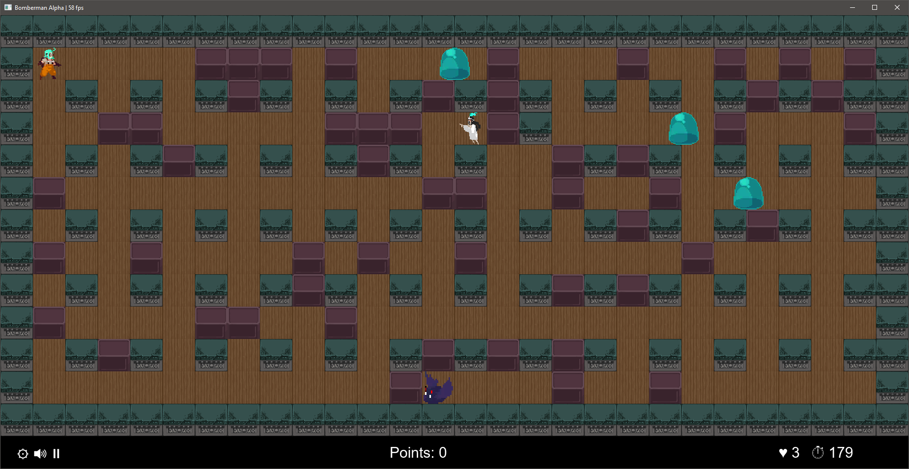
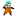
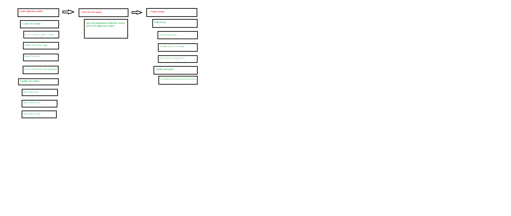

# Bomberman Retro Dungeon
Các thành viên nhóm UET K64-K2:
- Hoàng Hải Nam
- Đinh Ngọc Sơn
- Nguyễn Tiến Nghĩa

Phiên bản: JDK 17

Hướng dẫn: 
1. Copy đường dẫn của **ib\lib** sau khi giải nén (sau đây gọi là PATH).
2. Mở IntelliJ chọn **Module Setting\Library\\+\PATH**.
3. Tiếp theo tại nút **Run\⋮\Run with parameter\Modify option\Add VM Option**.
4. Điền *--module-path="PATH" --add-modules=javafx.controls,javafx.fxml,javafx.media*.
5. Run.

Đây là một phiên bản được xây dựng lại từ tựa game huyền thoại của NES.



## Mô tả về các đối tượng trong trò chơi
Trò chơi gồm 3 loại đối tượng chính: 
- Vật chuyển động (movableEntity).

 Bomber là nhân vật chính của trò chơi. Khi bắt đầu sẽ có 3 mạng, được cầm 1 quả bom. Nhân vật có thể di chuyển theo 4 hướng trái/phải/lên/xuống theo sự điều khiển của người chơi.

 Slime là con quái vật đầu tiên của trò chơi, có độ khó dễ nhất. Di chuyển liên tục và sẽ hướng ngược lại khi gặp phải chướng ngại vật.

 Bat là con quái vật thứ hai, có độ khó vừa phải. Con quái này luôn tìm đến người chơi và chỉ dừng lại khi đã tiêu diệt người chơi.

 Ghost là quái vật có độ khó lớn nhất, đồng thời di chuyển phức tạp nhất. Con quái này sẽ giả vờ như không thấy người chơi, tuy nhiên sẽ tấn công khi người chơi lại gần, tốc độ được nhân đôi khi bay theo hướng lên/xuống và có thể di xuyên tường.

- Vật bất động (immovableEntity).

 Bomb là đối tượng được đặt theo vị trí người chơi và có tầm xa mặc định là 1 ô. Hướng nổ mặc định của bomb là hình dấu "+". Độ dài của bomb bị giới hạn lại nếu hướng nổ bị chặn bởi tường hoặc gạch và nổ theo mặc định nếu là người chơi và quái vật.

 Flame là một vật phẩm nâng cấp tăng tầm xa của bomb, mặc định sẽ tăng 1 giá trị tầm xa của bomb. Vật phẩm nâng cấp là luôn được giấu dưới một viên gạch (Brick) và người chơi sẽ phải đi tìm bằng cách phá hủy viên gạch đó. Vật phẩm sẽ bị phá hủy nếu bị nổ trong tầm của bomb.

 Heart là vật phẩm nâng cấp, mặc định tăng thêm 1 mạng cho người chơi.

 Boot là vật phẩm nâng cấp, mặc định tăng 1,5 lần tốc độ của người chơi

 Portal là thứ người chơi phải đi tìm để có thể qua màn. Cũng như các vật phẩm, portal sẽ được giấu đi. Tuy nhiên, người chơi cần tiêu diệt hết quái vật mới có thể qua màn. Sau mỗi màn chơi, người chơi sẽ được cộng thêm điểm với thời gian còn lại tương ứng.

- Vật làm nền (stillObject).

 Tường là vật cứng nhất trong trò chơi, không thể bị phá hủy bằng bất kỳ cách nào. Thứ duy nhất có thể đi xuyên tường là Ghost.

 Brick là đối tượng không thể đi xuyên giống như tường, tuy nhiên có thể bị phá hủy và sẽ lộ diện vật phẩm được giấu trong đó.

 Ground là đối tượng có tác dụng làm nền, có thể di chuyển tùy ý, không thể biến mất và phá hủy.

## Mô tả giao diện

Màn hình chính gồm 3 nút:
- Play: Người chơi sẽ chơi lại từ đầu với số điểm là 0 và số mạng là 3.
- Continue: Người chơi tiếp tục màn đã chơi gần nhất. Tuy nhiên khi game over, người chơi sẽ phải chơi lại từ Stage 1.
- Credit: Danh sách các thành viên trong nhóm làm game.

Màn hình trong game gồm các nút:
- Setting: Người chơi sẽ dừng màn chơi hiện tại và quay về màn hình chính.
- Mute: Tắt tiếng trong game.
- Pause: Tạm dừng game cho đến khi người chơi bật lại.

## Mô tả Gameplay

- Người chơi phải dẫn dắt nhân vật chính vượt qua được màn chơi, bằng cách phá hủy Brick để tìm portal và dùng Bomb để tiêu diệt quái vật. 
- Độ khó của game sẽ ngày càng tăng và khi vượt qua được màn thứ 10, người chơi sẽ hoàn thành nhiệm vụ và kết thúc trò chơi.

Người chơi có các nút điều khiển sau:
1. Arrow Right, Arrow Left, Arrow Up, Arrow Down: Tương ứng với hướng đi phải/trái/lên/xuống.
2. ESC: Tương ứng với nút Setting.
3. F1: Pause game.
4. F2: You are a cheater!

Cách tính điểm trong game:
- Tiêu diệt Slime + 200đ.
- Tiêu diệt Bat + 500đ.
- Tiêu diệt Ghost + 1000đ.
- Qua màn + 100đ * thời gian còn lại.

## Mô tả thuật toán

- Sơ đồ thuật toán:
  
  - Pha 1: Tạo ma trận kề:
    - Ma trận 2D với số hàng bằng số cột bằng WIDTH*HEIGHT. 
    - Ma trận này lưu trữ thông tin xem liệu 2 vị trí kề nhau có thể đi qua nhau được không. Ví dụ adj[1][2] = true hiểu là từ vị trí (location) 1 có thể đi tới 2 và ngược lại.
    - Ma trận sẽ được dùng trong lúc tìm đường đi.
    - 1.1: Mỗi một thành phần trong game đều có toạ độ riêng(hệ pixel). Do đó ta cần đưa chúng về hệ trục toạ độ đơn vị (x_unit, y_unit). Sau đó ta đưa chúng về mảng 1 chiều với vị trí xác định cho từng phần tử.
      ```java:
      int local_enemy = (e.getY() / Sprite.SCALED_SIZE) * WIDTH + (e.getX() / Sprite.SCALED_SIZE); //local pixel -> local unit ->local adjMatrix
      ```
    - 1.2: Khởi tạo:
      ```java:
      for (int i = 0; i < no_nodes; i++) {
              for (int j = 0; j < no_nodes; j++) {
                  AdjMatrix[i][j] = false;
              }
          }
      ```
    - 1.3: Expand: Mỗi ô trong 2D đều có 4 ô sát nó
      ```java:
      public static void modifyMatrix(int x, int y, boolean[][] adjacencyMatrix) {
          /*
              -->x
              y       left_up  |mid_up  |right_up
                      mid_left |*       |mid_right
                      left_down|mid_down|right_down
           */
          int temp = y * width + x;
          //get 8 direction
          int adj_x, adj_y;
          //mid_up
          adj_x = x;
          adj_y = y - 1;
          modifyMatrixUnit(temp, adj_x, adj_y, adjacencyMatrix);
          //mid_left
          adj_x = x - 1;
          adj_y = y;
          modifyMatrixUnit(temp, adj_x, adj_y, adjacencyMatrix);
          //mid_right
          adj_x = x + 1;
          adj_y = y;
          modifyMatrixUnit(temp, adj_x, adj_y, adjacencyMatrix);
          //mid_down
          adj_x = x;
          adj_y = y + 1;
          modifyMatrixUnit(temp, adj_x, adj_y, adjacencyMatrix);
      }
      ```
    - 1.4: Remove: Những ô có liên hệ với tường và gạch là đều không tồn tại
      ```java:
      for (int i = 0; i < height; i++) {
              for (int j = 0; j < width; j++) {
                  if (mapGame[i][j]) {
                      //current position has wall or brick
                      int index = i * width + j;
                      for (int k = 0; k < no_nodes; k ++) {
                          AdjMatrix[index][k] = false;
                          AdjMatrix[k][index] = false;
                      }
                  }
              }
          }
      ```
    - 1.5: Update: Khi ta làm nỗ tường(brick) hay khi ta đặt bom cũng như bom nổ đều làm bản đồ game thay đổi vì thế ảnh hưởng tới đường đi của quái(enemy). Do vậy ta cần update cho ma trận kề. Ví dụ về nổ tường:
      ```java:
      int temp_x = e.getX() / Sprite.SCALED_SIZE;
      int temp_y = e.getY() / Sprite.SCALED_SIZE;
      for (int u = 1; u < WIDTH*HEIGHT - 1; u++) {
        adjMatrix[local][u] = Convert2DToAdjMatrix.AdjMatrixBackUp[local][u];
        adjMatrix[u][local] = Convert2DToAdjMatrix.AdjMatrixBackUp[u][local];
      }
      ```  
  - Pha 2: Cài đặt thuật toán tìm đường dựa trên breath first search(BFS): 
      ```java:
      //BFS
      private static int[] BFS(boolean[][] AdjMatrix, int source, int dest) {
        boolean[] visited = new boolean[no_nodes];
        int[] parent = new int[no_nodes];

        for (int i = 0; i < no_nodes; i++) {
            visited[i] = false;
            parent[i] = -1;
        }

        LinkedList<Integer> queue = new LinkedList<Integer>();
        queue.add(source);
        visited[source] = true;
        while (queue.size() != 0)
        {
            source = queue.peek();
            queue.remove();
            for (int u = 0; u < no_nodes; u++) {
                if (!visited[u] && AdjMatrix[source][u]) {
                    queue.add(u);
                    visited[u] = true;
                    parent[u] = source;
                    if (u == dest) {
                        return parent;
                    }
                }
            }
        }
        return parent;
    }

    public static ArrayList<Integer> findWay(boolean[][] AdjMatrix, int source, int dest) {
        int[] parent = BFS(AdjMatrix, source, dest);
        ArrayList<Integer> wayBackHome = new  ArrayList<>();
        int u = dest;
        while (parent[u] != -1) {
            wayBackHome.add(parent[u]);
            u = parent[u];
        }
        return wayBackHome;
    }
      ```
  - Pha 3: Điều khiển quái đi theo đường tìm được: 
    - Tưởng tượng rằng con đường giữa quái phải đi qua n điểm. Ví đụ Enemy -> A -> B -> C -> Bomber. Vì thế ta sẽ cho quái đi qua từng điểm trên con đường đã tìm được. Và mỗi khi di chuyển chỉ có đi theo chiều dọc hoặc ngang nên chỉ có x hoặc y thay đổi không có đồng thời x, y thay đổi.
    - x_goal, y_goal là toạ độ trên hệ pixel của điểm trên đường đi, ở trong ví dụ trên là toạ độ của điểm A.
    - Vấn đề là toạ độ của bomber và oneal luôn thay đổi do đó khi đã tới được điểm gần nhất cần đến (điểm A trên hình) thì cần phải gọi lại hàm findway() để tìm được đường mới. Điểm đầu tiên trên đường đi mới sẽ là điểm tiếp theo quái cần di chuyển tới.
    
